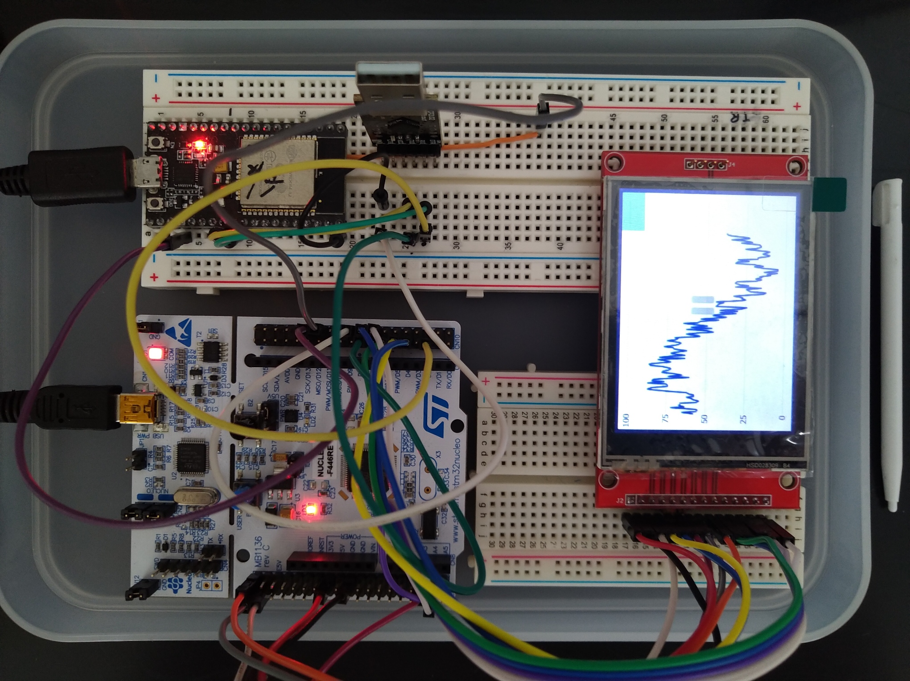

# NucleoF446RE_ILI9341_DynaGraph_OS_Cube
## Outview

## PIN assignment (STM32F466RE-Nucleo　--- LCD+Touch via SPI2 & SPI3)
<pre>
● LCD via SPI3
            STM32       LCD		Comment
SPI3_CLK    PC10        SCK             Pullup by Configurator
SPI3_MOSI   PB0         SDI
SPI3_MISO   PC11        SDO
SPI3_NSS    PC12        CS
            PB5         DC
            PB4         RESET
            LED         VCC with 10kohm
● ILI9341 via SPI2
            STM32       LCD             Comment
SPI2_CLK    PC10        T_CLK           Pullup by Configurator and 10Kohm-Register
SPI2_MOSI   PC1         T_DIN
SPI2_MISO   PC2         T_DO
SPI2_NSS    PB2         T_CS
SPI2_IRQ    PB1         T_IRQ           No meaning??? refet to Note)
Note) Since the program reads touch info every tick by calling STM32TouchController::sampleTouch(), T_IRQ is not a trigger to read touch info.
Plus, HAL_GPIO_EXTI_Callback() to be called by T_IRQ interrupt would be only wasting the time.
So the progmra does not enable line 1 interrupt.
</pre>

## Reference site
<pre>
  https://helentronica.com/2021/01/22/touchgfx-on-a-custom-made-low-cost-board-with-the-ili9341-controller-over-spi/
  https://www.youtube.com/watch?v=suMytEyQTP4&t=758s
  https://www.youtube.com/watch?v=Zy0bTHvviiE&list=WL&index=8
  https://www.youtube.com/watch?v=5TNx5ZOkoPM&t=175s
</pre>

## Under construction for ESP32 Wifi function
